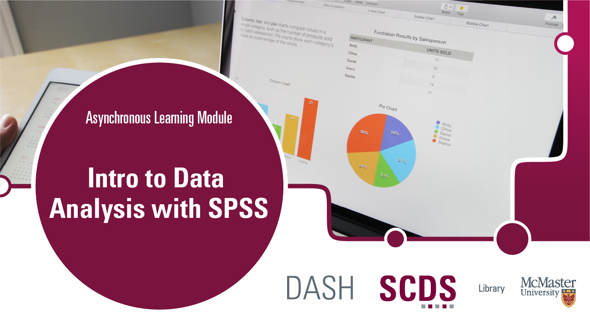

# Introduction to SPSS

This beginner-level workshop will introduce you to the basics of SPSS statistical software, how it works, and some basic descriptive statistics and statistical procedures. No prior knowledge of SPSS is required.

## Prerequisites
- Download [IBM SPSS]() (this will be covered in the [Preparation](preparation) page)
- Download the data files (this will be covered in the [Preparation](preparation) page)

## Learning Objectives
By the end of this workshop, you will be able to:
- Understand what SPSS can be used for
- Import data of various file types and from different software into SPSS
- Use the data editor to organize and view data
- Apply descriptive statistic functions to your data sets
- Create charts using existing data and computed variables

## Duration
This module will take around 2-3 hours, however feel free to work at your own pace!

## Land Acknowledgement
We'd like to acknowledge that McMaster University sits on the Territories of the Mississauga and Haudenosaunee Nations, and within the lands protected by the Dish With One Spoon wampum agreement.
