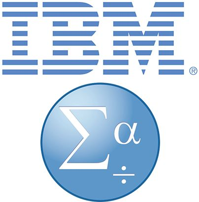

<!-- 
This page will go over introductory content to the workshop. 
If your workshop has an introduction sequence, whether it be history, "Why should you use __", or anything of that matter, this is where it goes! If your workshop doesn't need this, delete introduction.md from the repository. 
Add, edit, or remove any content below for the workshop in question. 
-->

# Workshop Introduction 
<!-- Follow along with the introductory video, slides, or text below. -->

<!-- If your page has a video to go along with it, put it here. -->
<!-- <iframe height="416" width="100%" allowfullscreen frameborder=0 src="https://echo360.ca/media/c387e1fe-8042-44d2-a114-3c50ef18c524/public"></iframe>
[View original here.](https://echo360.ca/media/c387e1fe-8042-44d2-a114-3c50ef18c524/public) -->

<!-- If your page has slides/PDFs/worksheets to go along with it, put it here. -->
<!-- <embed width="100%" height="466" src="assets/docs/twineIntro.pdf" style="border:none;">
[Download slides here.](assets/docs/twineIntro.pdf) -->

## What is SPSS?
 

SPSS, which stands for Statistical Product and Service Solutions, is a powerful statistical software used for data analysis in business, health care, and social science research. It is sometimes also called PASW, or Predictive Analysis Software.

SPSS is great for:
- Processing questionnaires
- Reporting in tables and graphs
- Analyzing means, Chi-Squared tests, regressional analysis, and much more!

### History of SPSS

SPSS was originally developed in 1968 by Norman H. Nie, Dale H. Bent, and C. Handlai Hull, who later incorporated as SPSS Inc in 1975. Originally, SPSS stood for "Statistical Package for the Social Sciences". The earliest versions of SPSS were designed only for mainframe computers, using punch cards for data and input.

In 2009, SPSS Inc was acquired by IBM, making SPSS now known as IBM SPSS Statistics.

### SPSS Features

- Can import data from many different programs, such as MS Excel and SAS.
- Provides analysis tools to generate reports, charts, plots, descriptive statistics, and run advanced statistical analysis.
- Provides a command syntax that can simplify certain things, such as running repetitive tasks.

### SPSS vs Excel

While both SPSS and Excel can both do statistical analysis, they are vastly different. 

Excel is a spreadsheet software, whereas SPSS is a statistical analysis software. The statistical analysis tools provided by SPSS are much more powerful, allowing for more complex analytics than Excel is capable of. 

