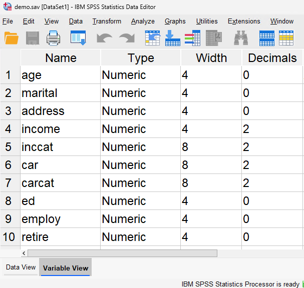
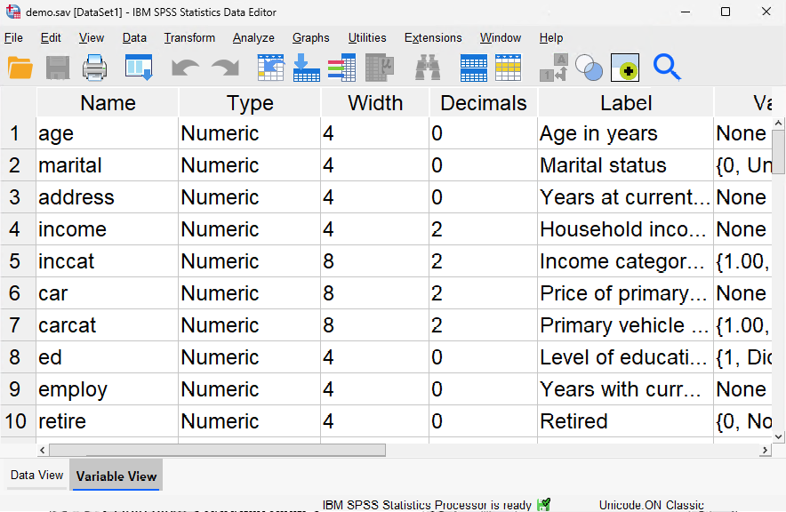
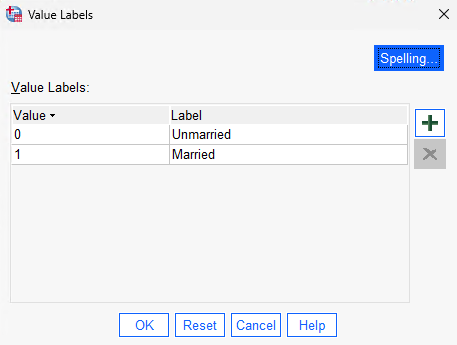

<!-- 
This page is an example lesson template.
Add, edit, or remove any content below for the workshop in question. -->

<!-- Putting a {: .no_toc} above a header removes it from the table of contents -->

{: .no_toc}  
# Lesson 1 - The SPSS Environment

In this lesson, before we begin using SPSS, we'll talk about its user interface and some of its features.

<!-- This is your table of contents. You don't need to touch it, it automatically creates it when you add or remove headers. If you do not want a header to be included, put {: .no_toc } above the header line, as you can see above with Lesson 1 - Lesson Name. Make sure that there's also an empty line above {: .no_toc }... Markdown is picky about this :( -->

  

    Table of Contents
  

  {: .text-delta }
- TOC
{:toc}

<!-- Here are your learning objectives. Just like in the introduction, but more specific for this lesson. -->
## Lesson Objectives
- Learn about the basic structure of a data file in SPSS.
- Understand the differences between the data view and variable view.
- Learn about labels for variables, data, and missing/invalid data.

<!-- A video for your lesson (if applicable) -->
<!-- ## Lesson Video
The following video demonstrates each of the steps outlined below in text. -->

<!-- Place iframe of video here -->
<!-- <iframe height="416" width="100%" allowfullscreen frameborder=0 src="https://echo360.ca/media/a65689c0-c35c-4f33-9c12-f0ac97883f54/public?autoplay=false&automute=false"></iframe>
[View original here.](https://echo360.ca/media/a65689c0-c35c-4f33-9c12-f0ac97883f54/public?autoplay=false&automute=false) -->

<!-- Text content format for your lessons if you don't want to rely on videos, or want to provide another format of learning consumption. -->
## SPSS Windows

There are many different types of windows in SPSS, such as:
- Data View
- Variable View
- Output Variable
- Pivot Table Editor
- Chart Editor
- Text Output Editor
- Syntax Editor
- and more

We'll talk about some of these in more depth in this lesson.

## Basic Structure of an SPSS Data File

IBM SPSS Statistics files are organized by **cases** (rows) and **variables** (columns). Typically, variables represent the responses to each question asked in a survey.

In the image above, you'll see the data view. Notice that the cases are numbered, where as the columns have labels. To find a particular respondant's answers, you can find their case (row). To find everyone's answer to a particular question, just look at that variable (column).

Some of the variables in this image include one's age, marital status, address, income, income category, and more. Variables can represent many different types, including numbers, strings, currency, and dates.

## Defining Data

The image above showcases the variable view. Here, you'll be defining your variable types and other details. Variables created here will be shown in the data view as a new column.

### Descriptive Labels

In addition to defining the type of data, you can also define descriptive variable labels and value labels for variable names and data values.

Descriptive labels are longer, more descriptive titles for variables. As you may have noticed, variables names are short and concise. When creating statistical reports and charts, SPSS will use the descriptive labels, whereas variable names are mainly used within the data sheet view.

### Value Labels

Value labels provide a method for mapping your variable values to string labels. In this example, there are two acceptable values for the *marital* variable. A value of 0 means that the subject is single, and a value of 1 means that they're married.

### Missing and Invalid Data

Missing and invalid data are too common to ignore. Survey respondents may refuse to answer certain questions, may not know the answer, or may answer in an unexpected format. If you don't properly filter or identify this data, your analysis may not provide accurate results.

For numeric data, empty data fields or fields containing invalid entries (like letters) are converted to `system-missing`, identifiable by a single period.

We can use the `Missing Values` tool to automatically apply more descriptive labels on our missing data.

<!-- Summarize your learning objectives here. It acts as a reminder to the learner about what they just learned, as well as a checklist for you to make sure you covered everything you wished to cover. -->
## Key Points / Summary

- In the data view, you can can assign data for each variable in cases.
- In the variable view, you can define the variables in your data.
- SPSS provides a tool to replace missing data, which is ignored in later data analyses.

