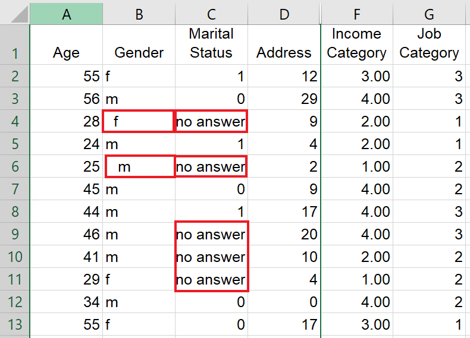

{: .no_toc}  
# Lesson 2 - Opening and Importing Data into SPSS 

In this lesson, we'll explore how to open and import data files into SPSS.  If you haven't already, download the data files from the [preparation page](../preparation). There should be three files: an SPSS data document (.sav), an Excel file (.xlsx), and a text file (.txt).

  

    Table of Contents
  

  {: .text-delta }
- TOC
{:toc}

## Lesson Objectives
- Open SPSS Data Documents
- Import Excel and text files using SPSS's import tools. 

<!-- ## Lesson Video
The following video demonstrates each of the steps outlined below in text.

<iframe height="416" width="100%" allowfullscreen frameborder=0 src="https://echo360.ca/media/a65689c0-c35c-4f33-9c12-f0ac97883f54/public?autoplay=false&automute=false"></iframe>
[View original here.](https://echo360.ca/media/a65689c0-c35c-4f33-9c12-f0ac97883f54/public?autoplay=false&automute=false) -->

## Opening SPSS Data Documents (.sav)
- Open SPSS if you haven't already, and open `data.sav`.
  - Browse for the file if prompted.
  - Otherwise, go to `File` > `Open` > `Data` and find the file.
  
- If an Output Window pops up, minimize it for now.
  

You should now have your SPSS Data Document open.

## Importing Excel Files (.xlsx)

Before importing our Excel file, let's take a look at the file in MS Excel.

There are some common problems that may appear in data files. 
- Leading and trailing spaces
- Empty data cells
- Data cells with invalid values

SPSS provides tools to deal with these problems when importing data.

- Close your MS Excel window and go back to SPSS.
- Go to `File` > `Import Data` > `Excel` and find `data.xlsx`.

This will open up an import tool. You'll have a few options to choose from, such as whether to remove leading/trailing spaces, whether the first row contains variable names, and more.

A preview window is provided below to see how the data will look after the import finishes. The most important setting is `Percentage of values that determine data type`. This will automatically deal with blank and invalid values, replacing them with System Missing. Notice that, if you turn off this setting, Marital Status becomes a String type rather than a numeric type, which is not what we want.

Once you're done, double-check your settings and click `OK`.

## Importing Text Files (.txt)

Importing a text file with data is quite similar to importing an Excel file, but there are more options and settings to take care of. Just like last time, let's take a look at our text file before importing.

We can see some of the same problems we encountered in our Excel file. Leading and trailing spaces, as well as `no answer` values. In the text file, the data isn't aligned with their rows either.

If you mess around with the data, you'll notice that it's tab-delimited. This'll help SPSS differentiate the difference between "Income Category" and "Income" + "Category".

- Close your text file and go back to SPSS.
- Go to `File` > `Import Data` > `Text data...` and find `data.txt`.

A "Text Import Wizard" will pop up to prompt you with questions about the data.

{: .no_toc }
### Step 1

If you've used the Text Wizard before, you'll be able to export the settings to a TextWizard Predefined Format file. Since this is our first time, we'll want to say `No` and click `Next`.

{: .no_toc }
### Step 2

Our data is delimited by tabs, with the first line in the data being our variable names. We're also using a period (.) for our decimal symbol. 

{: .no_toc }
### Step 3

The data starts on line 2, with each line representing one participant (or one case), and we want to import all the cases. You can also import the first X cases or a random percentage of the data.

{: .no_toc }
### Step 4

This is where we can choose our delimiter and get rid of our extra spaces.

{: .no_toc }
### Step 5

You might have received a warning message regarding invalid variable names. It's important to note that there are some limitations to variable names.

- Variable names can be up to 32 characters long.
- Variable names can only include alphanumeric characters (letters and numbers), non-punctuation characters (like a dash - or an underscore _), and a period (.).
- No spaces are allowed in variable names.
- Variable names cannot end with a period (.) or an underscore (_).
- There are some reserved keywords you can't use as variables, such as AND, NOT, OR, etc.
- Variable names must be unique.

After clicking `OK`, you're given the chance to set the variable types and rename the variables. For now, we'll leave them as automatic and click `Next`.

{: .no_toc }
### Step 6

Finally, your data is imported. You're given the option to save the file format as a TextWizard Predefined Format file. This is particularly useful if you have multiple files to import with the same formatting.

To view your data in SPSS, click on `Finish`.

## Key Points / Summary

- If you've got your data in another file format, it's super simple to import it into SPSS.
