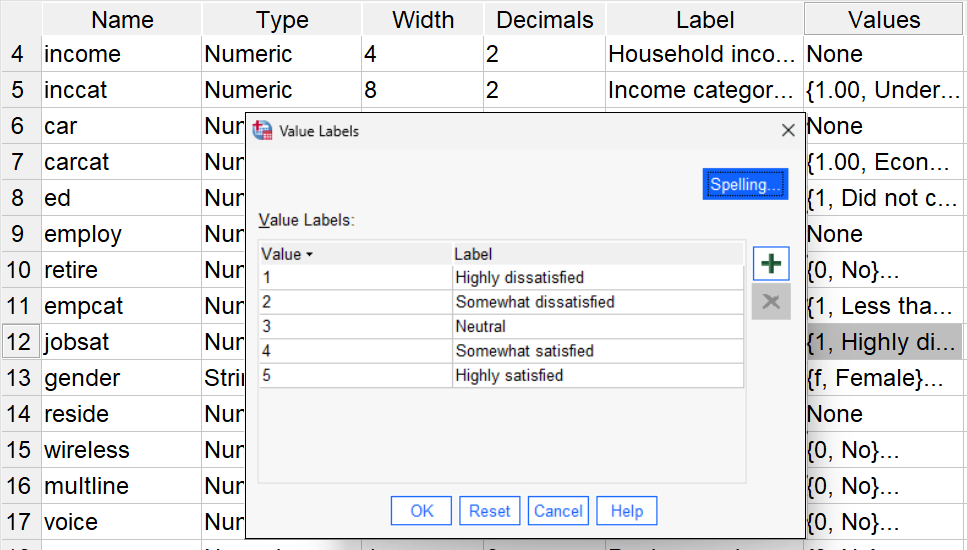
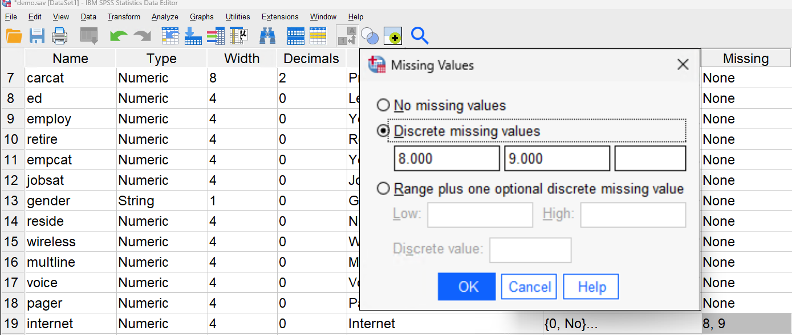
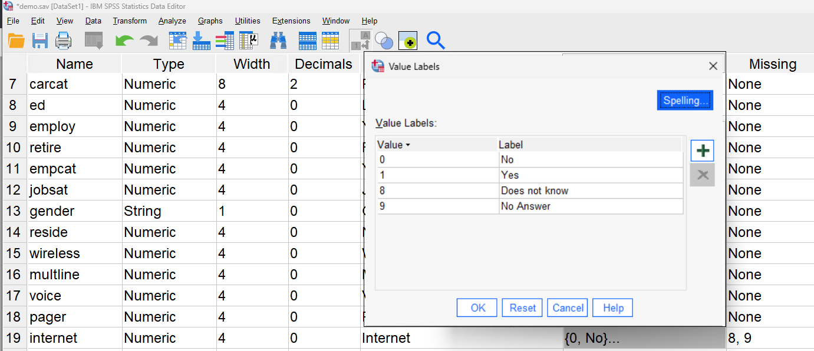
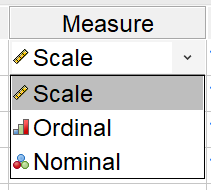
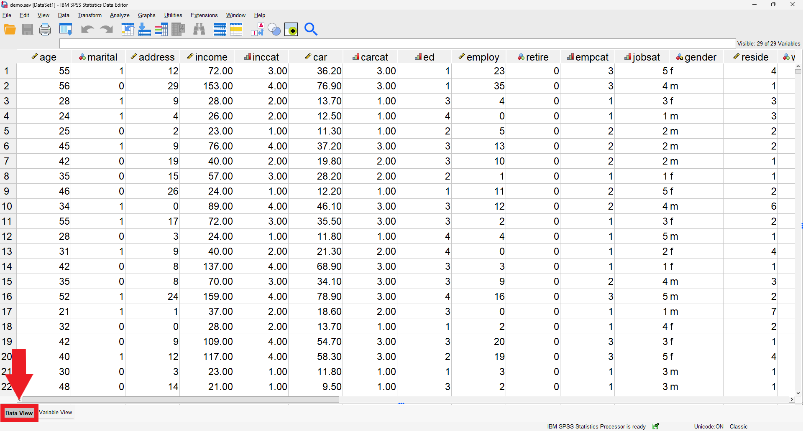

{: .no_toc}  
# Lesson 3 - The Data Editor

In this lesson, we will explore the data editor. In particular, we'll talk about some of the settings available for variables and viewing data in the data view.

  

    Table of Contents
  

  {: .text-delta }
- TOC
{:toc}

## Lesson Objectives
- Learn how to use and create descriptive and data labels.
- Explore the differences between scale, ordinal, and nominal data measures.

<!-- ## Lesson Video
The following video demonstrates each of the steps outlined below in text.

<iframe height="416" width="100%" allowfullscreen frameborder=0 src="https://echo360.ca/media/a65689c0-c35c-4f33-9c12-f0ac97883f54/public?autoplay=false&automute=false"></iframe>
[View original here.](https://echo360.ca/media/a65689c0-c35c-4f33-9c12-f0ac97883f54/public?autoplay=false&automute=false) -->

## Variable View

For the rest of this module, we'll be working with `demo.sav`. If you don't already have it open, take a moment now to do so.

Before we take a further look at our data, let's go to the Variable View section of our Data Editor.

### Variable Types

When creating a variable, its type is one of the most important things to define. There are several options offered, but you'll usually be working with the Numeric and String types.

Numeric types allow for numerical input. This can be used to represent both numerical values and categorical data. 

When creating numeric types, you can specify how many decimal places to use. For example, any categorical data in our datasheet has zero decimal places because we only want to be working with whole numbers.

Strings allow for character input. In this example datasheet, only `gender` uses the String type. However, we could use strings to store participants' names.

When creating strings, you can specify a maximum width. The `gender` variable has a maximum of one character so that more characters aren't accidentally inputted.

### Descriptive Labels

As discussed in [the first lesson](lesson1), variables have a name and a descriptive label. 

Names are short and are seen in the Data Editor, whereas labels are longer and more descriptive and are instead seen when creating plots and graphs.

### Data Labels

Data labels are used to map a data value to a string label. In the example below, the numbers 1 through 5 are mapped to different levels of satisfaction.

You can add more labels by clicking the `+` button and assigning a label to a value.

### Missing Data

You can assign values to represent missing values or data that should be handled differently in analyses.  

In this example, we use the discrete values 8 and 9 to represent missing data. To understand the difference between 8 and 9, we created data labels.

Here we can see that a value of 8 means that the respondent answered "I don't know", whereas a value of 9 represents a field that was left empty.

### Variable Measure

Finally, we'll talk about a variable's measure type. Numeric data can have three different measure types, and it's important to understand the differences between them.

   

  

  <b>Scale: </b>  
  Data that can be shown on a measurement scale
  

  

  <b>Ordinal: </b>  
  Categorized data with an order or ranking
  

  

  <b>Nominal: </b>  
  Categorized data with no intrinsic order
  

## Viewing the Data
  
Now that we've talked about our variables, we can view our data. Click on the `Data View` button at the bottom.

The only important thing to mention here is that you're able to toggle between displaying raw data and labelled data using the `Value Labels` button at the top.

Now, instead of seeing values of `0` and `1` for marital status, we'll get actual readable data ("Married" and "Unmarried"). You can see this with a lot of the other categorical variables too.

## Key Points / Summary
- Numeric variable types are most common, but Strings are sometimes used.
- SPSS provides tools to deal with missing data.
- It's important to understand the differences between scale, ordinal, and nominal data.
- You can use data labels in the data view to better understand your data values.
