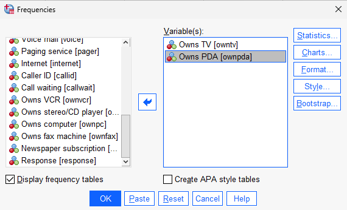
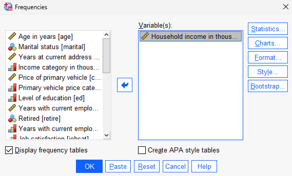
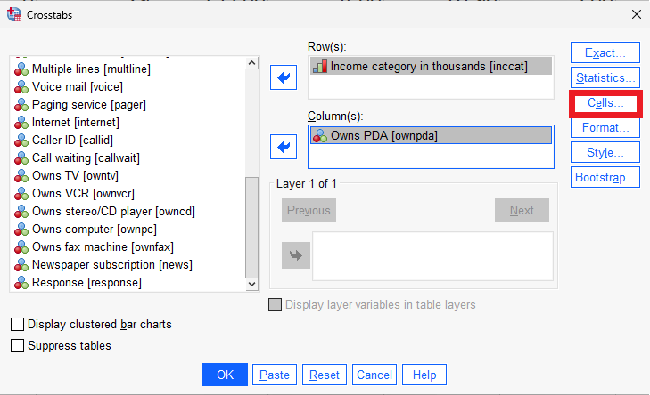
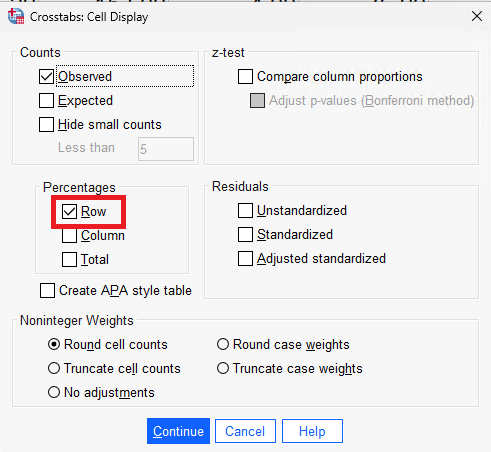
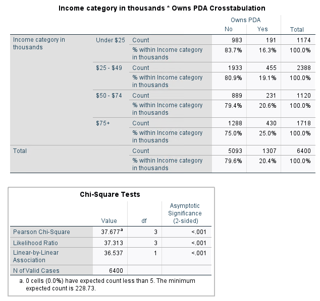

{: .no_toc}  
# Lesson 4 - Descriptive Statistics

In this lesson, we will use descriptive statistics on our data to get summaries and find relationships between variables.

  

    Table of Contents
  

  {: .text-delta }
- TOC
{:toc}

## Lesson Objectives
- Create frequency tables
- Use cross tabulation to find potential relationships between variables
- Use the Pearson chi-squared test to test the significance of relationships
- Design charts using the Chart Builder

<!-- ## Lesson Video
The following video demonstrates each of the steps outlined below in text.

<iframe height="416" width="100%" allowfullscreen frameborder=0 src="https://echo360.ca/media/a65689c0-c35c-4f33-9c12-f0ac97883f54/public?autoplay=false&automute=false"></iframe>
[View original here.](https://echo360.ca/media/a65689c0-c35c-4f33-9c12-f0ac97883f54/public?autoplay=false&automute=false) -->

## Descriptive Statistics

Descriptive statistics in data analysis summarize or describe features of a data set.

There are many reasons to look at descriptive statistics, such as:
- To double check if the data is correct
  - E.g. encountering unexpected values when creating a frequency table
- To explore data and identify potential group differences and associations
- To get a summary of variables

To find a list of descriptive statistics that SPSS supports, go to `Analyze` > `Descriptive Statistics`.  

## Frequency Tables

Let's take a look at the frequency table for some of our variables. Frequency tables creates a table that lists the number of times an item occurs. In this case, it finds the frequency of the different categories.   

Just like earlier, go to `Analyze` > `Descriptive Statistics`, and select `Frequencies...`.

To add variables to include in the frequency table, either double click on the desired variables, or click on the variable and then click on the arrow button in the middle. Same thing can be done to remove a variable.

For this example, include the `ownpda` and `owntv` variables. Once you're ready, click `OK`.

This should open up an Output Window with the frequency tables for those variables. In the top table, it shows you how much of the data is valid or invalid (missing or otherwise). Then the frequencies are shown below.

When you're done taking a look at the tables, close or minimize the output window and open the frequencies menu again.

{: .important-title }
> Tip
> 
> You can use the `Recall recently used dialogs` button to open up tools you've recently used.
>
> 

You can create additional charts based on the table data by clicking on the `Charts...` button and selecting the type of chart you'd like to create.

### Frequency Tables for Scale Variables

You can also create frequency tables for scale variables. To showcase this, close the output window and open up the frequency table setup menu.

Reset the variables by clicking on `Reset`, and then select the `income` variable. 

Alongside our frequency table, let's create some other descriptive statistics. 

Open up the statistics menu by clicking on `Statistics...`. In the statistics section, add the mean, median, std. deviation, minimum, and maximum. 

We'll also want to see a histogram of the data with its normal curve. When you're done, click on `Continue` and then `OK` to generate the data.

We haven't shown the frequency table because there's too many rows. 

## Cross-tabulation

Cross-tabulation (or crosstabs) display the relationship between two or more categorical variables. These types of tables are sometimes also known as two-way tables or contingency tables. 

In this section, we'll try to find the factor that affects PDA ownership.

To create a crosstab, go to `Analyze` > `Descriptive Analytics` > `Crosstabs...`.

Let's see whether the income category affects PDA ownership. To do so, add `inccat` to be the `Row` and `ownpda` to be the `Column`. 

Once you're ready, click on `OK` to create the crosstab.

At first glance, it's hard to analyze this data or to draw a relationship between the variables. This is because we're working with frequency numbers rather than percentages.

Close the output window and let's create another crosstab. We'll keep our variables the same, but we'll change a setting in the `Cells` menu.

In the `Cells` menu, we'll want to enable percentages for our row. 

Once you're done, click `Continue` and `OK`.

Now that we're able to view our data in terms of percentages, we can see more clearly that as a person's income increases, the percentage of people that own a PDA also increases.

## Significance Testing

Despite there being a relationship between a person's income and PDA ownership, it's possible that these are randomly correlated. SPSS provides a variety of tools to test the significance of data.

The test we will be using in this example is the Pearson chi-squared test. This will generate a p-value which, if it's under less than 0.05, lets us know that there's a significance in the relationship.

To use the Pearson chi-squared test, open the crosstab menu as usual. Open the `Statistics...` menu and select `Chi-square`.

Once you're done, click on `Continue...` and `OK`.

In the `Chi-Square Tests` table, the important value is the Asymptomatic Significance of the Pearson Chi-Square. If this value is below 0.05, the relationship is significant. Since it's < 0.001, the relationship between PDA ownership and a person's income is significant.

### Layer Variables

We can also use layer variables to see if there's specific subpopulations in which the test is significant, and other subpopulations where the test is insignificant.

Let's create another crosstab, with a Pearson chi-squared test, but also include the level of education as a layer variable.

Once you're done, click on `Continue` and `OK`.

Using the layer variable, we notice that only the population with a college degree has a significant correlation when comparing income with PDA ownership.

## Chart Builder

SPSS provides a Chart Builder tool to create charts.

To access the Chart Builder, go to `Graphs` > `Chart Builder`.

In this menu, you'll be able to choose what type of graph you'd like to make, the variables used, and more.

To demonstrate, let's create a simple bar graph with job satisfaction on our X axis and household income on our Y access. We can also assign a custom title, "Income by Job Satisfaction".

{: .note }
Note that the preview does not take the data values into account. 

Once you're done, click `OK` to generate the graph.

## Computing New Variables

Sometimes, there's the need to compute new variables out of existing ones. For example, we can find out the age that someone started working at a company by subtracting the amount of years they've been working with their current employer from their current age.

To compute a new variable, go to `Transform` > `Compute Variable`. 

This will open up a new menu where you can select variables and math operations. 

Let's create a new variable "age_jobstart".

After configuring the variable details in the variable view, you will be able to see it in the data view.

## Key Points / Summary
- Use cross tabulation to find potential relationships between variables
- Significance testing is important to see if variable relationships are valid