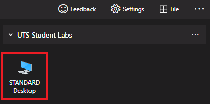
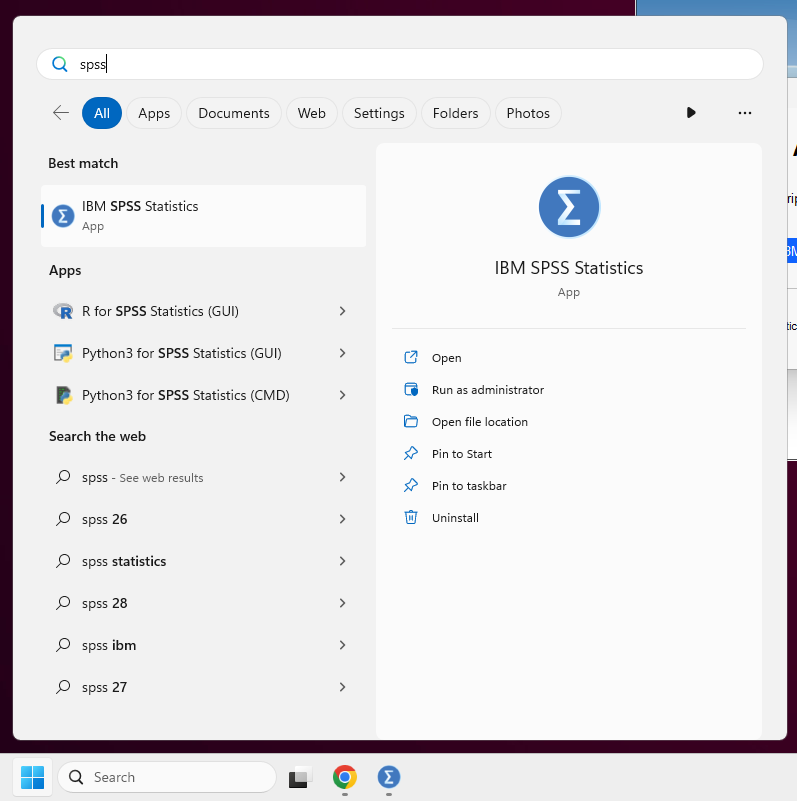
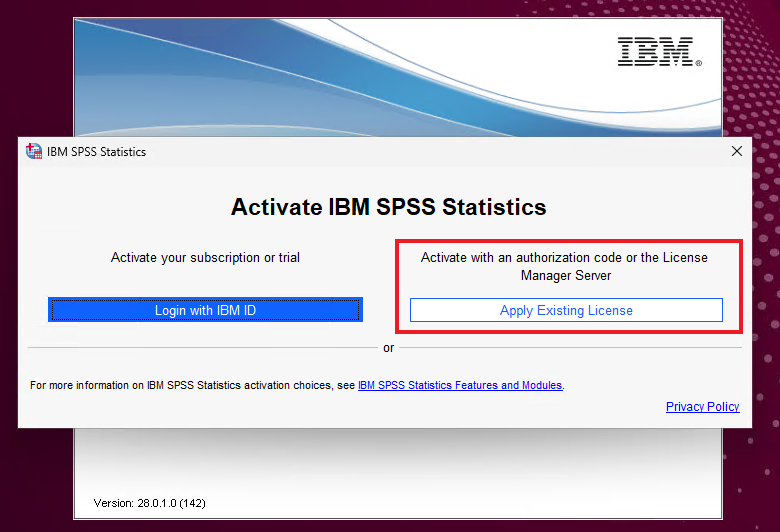
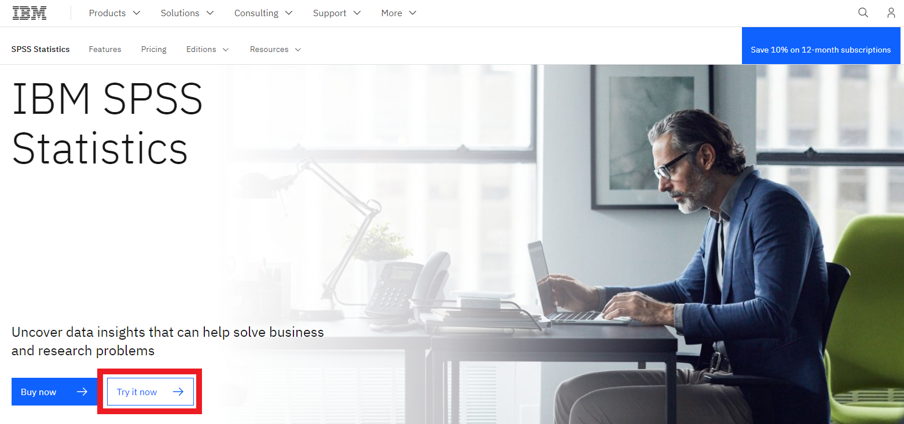

<!-- 
(OPTIONAL) This will be the page going over any installation or registration requirements.
Add, edit, or remove any content below for the workshop in question. 
-->

# Workshop preparation

## 1. Get Access to IBM SPSS Statistics

McMaster provides 24/7 instant access to fully configured university computers through Virtual Desktop. The computers come pre-installed with IBM SPSS Statistics, alongside a license. 

Alternatively, you can use use your own license and install it locally.

Virtual Desktop Instructions

{: .note }
You must be connected to the [McMaster VPN](https://uts.mcmaster.ca/services/computers-printers-and-software/virtual-private-networking/) to access this service. 

To access the university computers:
- Navigate to <https://uts.mcmaster.ca/services/teaching-and-learning/computer-labs/virtual-desktop/>
- Scroll down and either install virtual desktop locally (recommended), or use the web client. 
- Follow the instructions provided on the website to connect to the computers.
- Double click on `STANDARD Desktop` and log in.

- Once you're connected, search for "IBM SPSS Statistics" in the search box.

- When prompted to activate the software, click on `Apply Existing License`.

- You should now be able to access the software.

Local Installation Instructions

IBM offers a free 30-day trial for IBM SPSS Statistics, after which you'll need to buy a premium license. This trial version of SPSS contains all features, including add-ons. Take note that you'll need to be connected to the internet while you're using the program.

To get a free trial:
- Navigate to <https://www.ibm.com/products/spss-statistics>.
- Click on the button labeled `Try it now`.

- Create an account or log in with an existing IBM account.
- After verifying your account, you will be able to download the SPSS client. Download and follow the instructions given.

Alternatively, [The Campus Store](https://campusstore.mcmaster.ca/computers/software-licences.html) offers an Individual Premium Campus Edition license that expires at the end of each year.   

## 2. Download the datasets

Throughout the module, we will be using these datasets to test out some of the features SPSS has to offer.

- [demo.sav](data/demo.sav)
- <a href="data/demo.txt" download>demo.txt</a>
- [demo.xlsx](data/demo.xlsx)